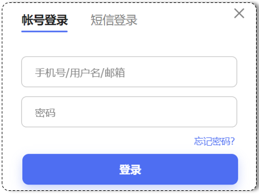
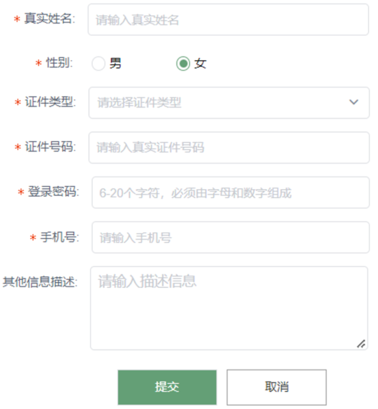

# 1. 前端开发介绍

我们介绍Web网站工作流程的时候提到，前端开发，主要的职责就是将数据以好看的样式呈现出来。说白了，就是开发网页程序，如下图所示：

   


那在讲解web前端开发之前，我们先需要对web前端开发有一个整体的认知。主要明确一下三个问题：

1). 网页有哪些部分组成 ?

文字、图片、音频、视频、超链接、表格等等。


2). 我们看到的网页，背后的本质是什么 ?

程序员写的前端代码 (备注：在前后端分离的开发模式中，)


3). 前端的代码是如何转换成用户眼中的网页的 ?

通过浏览器转化（解析和渲染）成用户看到的网页

浏览器中对代码进行解析和渲染的部分，称为 **浏览器内核**


而市面上的浏览器非常多，比如：IE、火狐Firefox、苹果safari、欧朋、谷歌Chrome、QQ浏览器、360浏览器等等。 而且我们电脑上安装的浏览器可能都不止一个，有很多。 

但是呢，需要大家注意的是，不同的浏览器，内核不同，对于相同的前端代码解析的效果也会存在差异。 那这就会造成一个问题，同一段前端程序，不同浏览器展示出来的效果是不一样的，这个用户体验就很差了。而我们想达到的效果则是，即使用户使用的是不同的浏览器，解析同一段前端代码，最终展示出来的效果都是相同的。

要想达成这样一个目标，我们就需要定义一个统一的标准，然后让各大浏览器厂商都参照这个标准来实现即可。 而这套标准呢，其实早都已经定义好了，那就是我们接下来，要介绍的web标准。


**Web标准**也称为**网页标准**，由一系列的标准组成，大部分由W3C（ World Wide Web Consortium，万维网联盟）负责制定。由三个组成部分：

- HTML：负责网页的结构（页面元素和内容）。

- CSS：负责网页的表现（页面元素的外观、位置等页面样式，如：颜色、大小等）。

- JavaScript：负责网页的行为（交互效果）。

 


当然了，随着技术的发展，我们为了更加快速的开发，现在也出现了很多前端开发的高级技术。例如：vue、elementui、Axios等等。

那基于此呢，我们的前端课程内容也是分为四个部分讲解：

- 第一部分：HTML & CSS 
- 第二部分：JavaScript
- 第三部分：Ajax & Vue3基础

- 第四部分：Vue项目 


那今天我们就先来讲解第一部分 HTML & CSS。


# 2. HTML & CSS

1). 什么是HTML ?

> ​    **HTML: **HyperText Markup Language，超文本标记语言。
>
> - 超文本：超越了文本的限制，比普通文本更强大。除了文字信息，还可以定义图片、音频、视频等内容。
>
> - 标记语言：由标签 `"<标签名>"` 构成的语言
>   - HTML标签都是预定义好的 。例如：使用 `<h1>` 标签展示标题，使用`<a>`展示超链接，使用``展示图片，`<video>`展示视频。
>   - HTML代码直接在浏览器中运行，HTML标签由浏览器解析 。

下面展示的是一段html代码经过浏览器解析，呈现的效果如右图所示：


2). 什么是CSS ?

> **CSS:** Cascading Style Sheet，层叠样式表，用于控制页面的样式（表现）。

下面展示的是一段 html代码 及 CSS样式 经过浏览器解析，呈现的效果如右图所示：


## 2.1 HTML快速入门

### 2.1.1 操作

**1. 新建文本文件，后缀名改为 .html，命名为：01. html快速入门.html 。**

  创建一个名为HTML的文件夹，然后找到课程资料中的 1.jpg 文件放到该目录下的img目录中。此时HTML文件夹中内容如下：

      

​	

**2. 编写HTML的基本骨架，定义标题**

​    选中文件，鼠标右击，选择使用记事本打开文件，并且编写网页的标题

​	首先html有固定的基本结构

~~~html
&lt;html&gt;
	&lt;head&gt;
		&lt;title&gt;HTML 快速入门&lt;/title&gt;
	&lt;/head&gt;
	&lt;body&gt;
		
	&lt;/body&gt;
&lt;/html&gt;
~~~

其中&lt;html&gt;是根标签，&lt;head&gt;和&lt;body&gt;是子标签。

- /&lt;head&gt; : 定义网页的头部，用来存放给浏览器看的信息，如：CSS样式、网页的标题。 

- /&lt;body&gt; : 定义网页的主体部分，存放给用户看的信息，也是网页的主体内容，如：文字、图片、视频、音频、表格等。


**3. 在`<body>`中编写HTML的核心内容**

```html
<html>
	<head>
		<title>HTML 快速入门</title>
	</head>
	<body>
		<h1>Hello HTML</h1>
		
	</body>
</html>
```

其中 `<h1>` 标签是一个一级标题的标签。 `` 标签是一个图片标签，用来展示图片，而其中的 src 属性是用来指定要展示的图片。

​	

**4. 然后选中文件，鼠标右击，选择使用浏览器打开文件。**

浏览器呈现效果如下:

    


### 2.1.2 总结

1). HTML页面的基础结构标签

~~~html
&lt;html&gt;
	&lt;head&gt;
    	&lt;title&gt; &lt;/title&gt;
    &lt;/head&gt;
    &lt;body&gt;
       
    &lt;/body&gt;
&lt;/html&gt;
~~~

&lt;title&gt;中定义标题显示在浏览器的标题位置，&lt;body&gt;中定义的内容会呈现在浏览器的内容区域


2). HTML中的标签特点

- HTML标签不区分大小写，建议小写
- HTML标签的属性值，采用单引号、双引号都可以，一般写双引号
- HTML语法相对比较松散 (建议大家编写HTML标签的时候尽量严谨一些)


## 2.2 开发工具

我们通过快速入门案例，发现由记事本文件开发html是非常不方便的，所以接下来我们需要学习一款前端专业的开发工具VS Code。

Visual Studio Code（简称 VS Code ）是 Microsoft 于2015年4月发布的一款代码编辑器。VS Code 对前端代码有非常强大的支持，同时也其他编程语言（例如：C++、Java、Python、PHP、Go等）。VS Code 提供了非常强大的插件库，大大提高了开发效率。

官网： https://code.visualstudio.com


详细安装教程：参考 **资料/2. VsCode安装文档/VS Code安装文档.md**

> &lt;font color='red'&gt;注意1 ：需要注意的是，我们作为一名开发者，不应该将软件软装在包含中文名的路径中 。&lt;/font&gt;
>
> &lt;font color='red'&gt;注意2 ：由于安装了IDEA快捷键的插件，VSCode快键键与IDEA是一致的。&lt;/font&gt;


## 2.3 基础标签 & 样式

那我们在讲解HTML的常见基础标签 及 CSS的基本样式时，我们就以 新浪新闻页面 为例，来进行讲解，这样大家不仅能够知道 常见标签及样式的作用，还能够知道具体的应用场景。

新浪新闻的具体页面效果如下：

 

原始页面网址：https://news.sina.com.cn/gov/xlxw/2023-07-24/doc-imzcsrkr9795977.shtml


而对于这个新浪新闻的页面来说，核心内容分为两个部分，如下：

- 新浪新闻-标题部分 (绿色标注的部分)
- 新浪新闻-正文部分 (黄色标注的部分)

​		  


### 2.3.1 新浪新闻-标题实现

#### 2.3.1.1 标题排版

##### 2.3.1.1.1 分析

  

 1). 第一部分，是一张图片，需要用到HTML中的图片标签 `` 来实现。

 2). 第二部分，是一个标题，需要用到HTML中的标题标签 `<h1>` ... `<h6>`来实现。

 3). 第三部分，有两条水平分割线，需要用到HTML中的 `<hr>` 标签来定义水平分割线。


##### 2.3.1.1.2 标签

1). 图片标签 img

```html
A. 图片标签: 

B. 常见属性: 
	src: 指定图像的url (可以指定 绝对路径 , 也可以指定 相对路径)
	width: 图像的宽度 (像素 / 百分比 , 相对于父元素的百分比)
	height: 图像的高度 (像素 / 百分比 , 相对于父元素的百分比)
	
	备注: 一般width 和 height 我们只会指定一个，另外一个会自动的等比例缩放。
	
C. 路径书写方式:
    绝对路径:
        1. 绝对磁盘路径: C:/Users/Administrator/Desktop/HTML/img/logo.png
        			   

        2. 绝对网络路径: https://i2.sinaimg.cn/dy/deco/2012/0613/yocc20120613img01/news_logo.png
        			   
    
    相对路径:
        ./ : 当前目录 , ./ 可以省略的
        ../: 上一级目录
```

&lt;font color='red'&gt;注意：一般图片的width、height只设置一个，图片会等比例缩放。&lt;/font&gt;


2). 标题标签 h 系列

```html
A. 标题标签: <h1> - <h6>
    
	<h1>111111111111</h1>
	<h2>111111111111</h2>
	<h3>111111111111</h3>
	<h4>111111111111</h4>
	<h5>111111111111</h5>
	<h6>111111111111</h6>
	
B. 效果 : h1为一级标题，字体也是最大的 ； h6为六级标题，字体是最小的。
```


3). 水平分页线标签 `<hr>`


**备注：而上述的 `<hr>` `` 标签呢，其实都属于单标签，也就是说是不需要结束标签的。**


##### 2.3.1.1.2 实现

1). 打开VsCode，选择左侧最顶部的 "资源管理器"，然后选择打开文件夹，选择打开桌面的 HTML 文件夹 

2). 将资料中提供的 图片、音频、视频 文件夹的这三个文件夹（里面是图片、音视频素材），复制到 HTML 文件夹中。 

  

3). 在VsCode中创建一个新的 html 文件，文件的后缀名设置为 .html

  

4). html 文件创建好之后，在其中输入 ！，然后直接回车，就可以生成 HTML 的基础结构标签

  

5). 编写标题排版的核心代码

```html
<!-- 文档类型为HTML -->
<!DOCTYPE html>
<html lang="en">
<head>
    <!-- 字符集为UTF-8 -->
    <meta charset="UTF-8">
    <!-- 设置浏览器兼容性 -->
    <meta http-equiv="X-UA-Compatible" content="IE=edge">
    <meta name="viewport" content="width=device-width, initial-scale=1.0">
    <title>焦点访谈：中国底气 新思想夯实大国粮仓</title>
</head>
<body>
      <!-- 
    img标签: 
        src: 图片资源路径
        width: 宽度(px, 像素 ; % , 相对于父元素的百分比)
        height: 高度(px, 像素 ; % , 相对于父元素的百分比)
        
        

    路径书写方式:
        绝对路径:
            1. 绝对磁盘路径: C:/Users/Administrator/Desktop/HTML/img/logo.png
                           

            2. 绝对网络路径: https://i2.sinaimg.cn/dy/deco/2012/0613/yocc20120613img01/news_logo.png
                           
        相对路径:
            ./ : 当前目录 , ./ 可以省略的
            ../: 上一级目录
     -->
      新浪政务 > 正文

     <h1>【新思想引领新征程】推进美丽中国建设 谱写绿色发展新篇章</h1>
     
     <hr>
     2023年07月23日 19:49 央视网
     <hr>

</body>
</html>
```


#### 2.3.1.2 标题样式

新浪新闻的标题部分的基本排版，我们已经完成了，然后大家会看到，我们编写的一级标题，默认字体颜色为纯黑色。 而原始的新浪新闻页面的新闻标题字体，并不是纯黑色，而是灰黑色， 那接下来，我们就要来设置这个字体的颜色。 而要设置这个字体的颜色，我们就需要通过CSS样式来控制 。

那在HTML的文件中，我们如何来编写CSS样式呢，此时就涉及到CSS的三种引入方式。


##### 2.3.1.2.1 CSS引入方式

具体有3种引入方式，语法如下表格所示：

| 名称     | 语法描述                                          | 示例                                           |
| -------- | ------------------------------------------------- | ---------------------------------------------- |
| 行内样式 | 在标签内使用style属性，属性值是css属性键值对。    | &lt;h1 style="xxx:xxx;">中国新闻网&lt;/h1>     |
| 内嵌样式 | 定义&lt;style&gt;标签，在标签内部定义css样式。    | &lt;style> h1 {...} &lt;/style>                |
| 外联样式 | 定义&lt;link&gt;标签，通过href属性引入外部css文件 | &lt;link rel="stylesheet" href="css/news.css"> |

对于上述3种引入方式，企业开发的使用情况如下：

1. 内联样式会出现大量的代码冗余，不方便后期的维护，所以不常用（常配合JS使用）。
2. 内部样式，通过定义css选择器，让样式作用于当前页面的指定的标签上。（可以写在页面任何位置，但通常约定写在head标签中）
3. 外部样式，html和css实现了完全的分离，企业开发常用方式。


##### 2.3.1.2.2 颜色表示

在前端程序开发中，颜色的表示方式常见的有如下三种：

| **表示方式**   | 属性值           | **说明**                             | **取值**                                    |
| -------------- | ---------------- | ------------------------------------ | ------------------------------------------- |
| 关键字         | 颜色英文单词     | red、green、blue                     | red、green、blue...                         |
| rgb表示法      | rgb(r, g, b)     | 红绿蓝三原色，每项取值范围：0-255    | rgb(0,0,0)、rgb(255,255,255)、rgb(255,0,0)  |
| rgba表示法     | rgba(r, g, b, a) | 红绿蓝三原色，a表示透明度，取值：0-1 | rgb(0,0,0,0.3)、rgb(255,255,255,0.5)        |
| 十六进制表示法 | #rrggbb          | #开头，将数字转换成十六进制表示      | #000000、#ff0000、#cccccc，简写：#000、#ccc |


##### 2.3.1.2.3 标题字体颜色

```html
<!DOCTYPE html>
<html lang="en">
<head>
    <meta charset="UTF-8">
    <meta http-equiv="X-UA-Compatible" content="IE=edge">
    <meta name="viewport" content="width=device-width, initial-scale=1.0">
    <title>【新思想引领新征程】推进美丽中国建设 谱写绿色发展新篇章</title>
    <!-- 方式二: 内嵌样式 -->
    <style>
        h1 {
            /* color: red; */
            /* color: rgb(0, 0, 255); */
            color: #4D4F53;
        }
    </style>

    <!-- 方式三: 外联样式 -->
    <!-- <link rel="stylesheet" href="css/news.css"> -->
</head>
<body>
     新浪政务 > 正文
	
    <!-- 方式一: 行内样式 -->
    <!-- <h1 style="color: red;">【新思想引领新征程】推进美丽中国建设 谱写绿色发展新篇章</h1> -->
    
    <h1>【新思想引领新征程】推进美丽中国建设 谱写绿色发展新篇章</h1>

    <hr>
    2023年07月23日 19:49 央视网
    <hr>

</body>
</html>
```

备注: 要想拾取某一个网页中的颜色，我们可以借助于截图软件的拾色器插件来完成。【截图软件在资料中已经提供】


##### 2.3.1.2.4 CSS选择器

顾名思义：选择器是选取需设置样式的元素（标签），但是我们根据业务场景不同，选择的标签的需求也是多种多样的，所以选择器有很多种，因为我们是做后台开发的，所以对于css选择器，我们只学习最基本的3种。

**选择器通用语法如下**：

```css
选择器名   {
    css样式名：css样式值;
    css样式名：css样式值;
}
```


我们需要学习的3种选择器是元素选择器，class选择器，id选择器，语法以及作用如下：

**1.元素（标签）选择器：** 

- 选择器的名字必须是标签的名字
- 作用：选择器中的样式会作用于所有同名的标签上

~~~
元素名称 {
    css样式名:css样式值；
}
~~~

例子如下：

~~~css
 h1{
     color: red;
 }
~~~


**2.类选择器：**

- 选择器的名字前面需要加上 .
- 作用：选择器中的样式会作用于所有class的属性值和该名字一样的标签上，可以是多个

~~~
.class属性值 {
    css样式名:css样式值；
}
~~~

例子如下：

~~~css
.cls{
     color: green;
 }
~~~


**3.id选择器:**

- 选择器的名字前面需要加上#
- 作用：选择器中的样式会作用于指定id的标签上，而且有且只有一个标签（由于id是唯一的）

~~~
#id属性值 {
    css样式名:css样式值；
}
~~~

例子如下：

~~~css
#hid {
    color: blue;
}
~~~


##### 2.3.1.2.5 发布时间字体颜色

```html
<!DOCTYPE html>
<html lang="en">
<head>
    <meta charset="UTF-8">
    <meta http-equiv="X-UA-Compatible" content="IE=edge">
    <meta name="viewport" content="width=device-width, initial-scale=1.0">
    <title>焦点访谈：中国底气 新思想夯实大国粮仓</title>
    <style>
        h1 {
            color: #4D4F53;
        }

        /* 元素选择器 */
        /* span {
            color: red;
        } */

        /* 类选择器 */
        /* .cls {
            color: green;
        } */
        
        /* ID选择器 */
        #time {
            color: #968D92;
            font-size: 13px; /* 设置字体大小 */
        }
    </style>
</head>
<body>

     新浪政务 > 正文
    <h1>焦点访谈：中国底气 新思想夯实大国粮仓</h1>
    <hr>
    <span class="cls" id="time">2023年03月02日 21:50</span>  <span class="cls">央视网</span>
    <hr>

</body>
</html>
```

上述我们还使用了一个css的属性 font-size , 用来设置字体的大小。 但是需要注意，在设置字体的大小时，单位px不能省略，否则不生效。


#### 2.3.1.3 超链接

- 在新浪新闻的标题部分，当我们点击顶部的 "新浪政务"，浏览器将自动在当前窗口访问新浪政务首页这个资源（http://gov.sina.com.cn/）

- 当我们点击新闻发布时间之后的 "央视网"，浏览器将会自动打开一个新的标签页，然后在新的标签页中访问央视网中的该新闻资源 （https://news.cctv.com/2023/07/23/ARTI0KLN7plgs92l02aD0hTe230723.shtml）


那接下来，我们就来完善新闻标题部分的这个功能，那此时呢，我们就需要用到HTML中的超链接的标签 。


##### 2.3.1.3.1 介绍

- 标签: &lt;a href="..." target="...">央视网&lt;/a&gt;
- 属性:
  - href: 指定资源访问的url
  - target: 指定在何处打开资源链接
    - _self: 默认值，在当前页面打开
    - _blank: 在空白页面打开


##### 2.3.1.3.2 实现

```html
<!DOCTYPE html>
<html lang="en">
<head>
  <meta charset="UTF-8">
  <meta name="viewport" content="width=device-width, initial-scale=1.0">
  <title>【新思想引领新征程】推进美丽中国建设 谱写绿色发展新篇章</title>
  <style>
    /* 1. 标签选择器 */
    h1 {
      color: #4d4f53;
    }

    .time {
      font-size: 12px;
      color: #888;
    }

    a {
      text-decoration: none;
      color: #4d4f53;
    }
  </style>
</head>
<body>
      <a href="https://gov.sina.com.cn/"  target="_self">新浪政务</a> > 正文
     <h1 class="cls" id="hid">【新思想引领新征程】推进美丽中国建设 谱写绿色发展新篇章</h1>
     <hr>
     <span class="time">2023年07月23日 19:49</span>    
     <a href="https://news.cctv.com/2023/07/23/ARTI0KLN7plgs92l02aD0hTe230723.shtml" target="_blank">央视网</a>
     <hr>
     
</body>
</html>
```


浏览器打开此页面，我们可以看到最终效果（超链接的字体，以及默认的下划线，通过css样式已经调整好了）：

  

 


### 2.3.2 新浪新闻-正文实现

#### 2.3.2.1 正文排版

##### 2.3.2.1.1 分析

  

整个正文部分的排版，主要分为这么四个部分：

1). 视频 (当前这种新闻页面,可能也会存在音频)

2). 文字段落

3). 字体加粗

4). 图片


##### 2.3.2.1.2 标签

**1). 视频、音频标签**

- 视频标签: &lt;video>
  - 属性: 
    - src: 规定视频的url
    - controls: 显示播放控件
    - width: 播放器的宽度
    - height: 播放器的高度

- 音频标签: &lt;audio>
  - 属性:
    - src: 规定音频的url
    - controls: 显示播放控件


**2). 段落标签**

- 换行标签: &lt;br>
  - 注意: 在HTML页面中,我们在编辑器中通过回车实现的换行, 仅仅在文本编辑器中会看到换行效果, 浏览器是不会解析的, HTML中换行需要通过br标签

​	

- 段落标签: &lt;p>
  - 如: &lt;p> 这是一个段落 &lt;/p>


**3). 文本格式标签**

| 效果   | 标签 | 标签(强调) |
| ------ | ---- | ---------- |
| 加粗   | b    | strong     |
| 倾斜   | i    | em         |
| 下划线 | u    | ins        |
| 删除线 | s    | del        |

前面的标签 b、i、u、s 就仅仅是实现加粗、倾斜、下划线、删除线的效果，是没有强调语义的。 而后面的strong、em、ins、del在实现加粗、倾斜、下划线、删除线的效果的同时，还带有强调语义。


##### 2.3.2.1.3 实现

```html
<!DOCTYPE html>
<html lang="en">
<head>
  <meta charset="UTF-8">
  <meta name="viewport" content="width=device-width, initial-scale=1.0">
  <title>【新思想引领新征程】推进美丽中国建设 谱写绿色发展新篇章</title>
  <style>
    /* 1. 标签选择器 */
    h1 {
      color: #4d4f53; /* 字体颜色 */
    }

    .time {
      font-size: 12px; /* 字体大小 */
      color: #888;
    }

    a {
      text-decoration: none; /* 文本装饰 */
      color: #4d4f53;
    }

    p {
      line-height: 30px; /* 行高 */
      text-indent: 35px; /* 首行缩进 */
    }

    .editor {
      text-align: right; /* 规定文本的水平对齐方式 */
    }
  </style>
</head>
<body>
      <a href="https://gov.sina.com.cn/">新浪政务</a> > 正文
     <h1 class="cls" id="hid">【新思想引领新征程】推进美丽中国建设 谱写绿色发展新篇章</h1>
     <hr>
     <span class="time">2023年07月23日 19:49</span>  <a href="https://news.cctv.com/2023/07/23/ARTI0KLN7plgs92l02aD0hTe230723.shtml" target="_blank">央视网</a>
     <hr>
     
     <video src="video/news.mp4" controls width="930px"></video>
     <p>
      <strong>央视网消息</strong>（新闻联播）：生态文明建设是关系中华民族永续发展的根本大计。习近平总书记指出，要把建设美丽中国摆在强国建设、民族复兴的突出位置，以高品质生态环境支撑高质量发展，加快推进人与自然和谐共生的现代化。各地坚持以习近平生态文明思想为指引，牢固树立和践行绿水青山就是金山银山的理念，以更高站位、更宽视野、更大力度，全面推进美丽中国建设。
     </p>
     
     
     <p>盛夏时节，神州大地山清水秀，万里河山多姿多彩。</p>
     <p>党的十八大以来，在以习近平同志为核心的党中央坚强领导下，一系列根本性、开创性、长远性工作全面开展，推进生态文明建设决心之大、力度之大、成效之大前所未有。从滚滚长江到浩浩黄河，从青藏高原到草场林海，习近平总书记对生态文明建设念兹在兹，倾注了巨大心血。</p>
     
     
     <p>在习近平生态文明思想科学指引下，各地坚定走生态优先、绿色发展之路。党的十八大以来，我国水环境质量发生转折性变化，2022年全国地表水水质优良断面比例提升至87.9%；绿色版图不断扩大，10年来全国完成造林约10.2亿亩；天空更蓝，2022年全国地级及以上城市空气质量优良天数比例达86.5%，重污染天数比例首次降到1%以内。新时代生态文明建设的成就举世瞩目，成为新时代党和国家事业取得历史性成就、发生历史性变革的显著标志。</p>
     <p>在前不久召开的全国生态环境保护大会上，习近平总书记强调，今后5年是美丽中国建设的重要时期，要以更高站位、更宽视野、更大力度来谋划和推进新征程生态环境保护工作，全面推进美丽中国建设。</p>
     
     
     <p>牢记习近平总书记嘱托，各地坚持山水林田湖草沙一体化保护和系统治理，努力寻找生态保护修复的最佳方案。在陕西，秦岭北麓主体山水林田湖草沙一体化保护和修复全面展开，聚焦秦岭北麓主体的生物多样性、水源涵养、水土保持3大功能，计划保护修复面积超35000公顷。在江苏无锡太湖沿岸，通过种植本土植物，打造湿地生物链，一座座小型湿地正成为太湖的生态屏障。在湖北丹江口水库库区，林管人员正在石漠化的山体上为新一轮植树造林做准备，今年丹江口库区预计造林66000亩。在黑龙江伊春，新技术将红松育苗上山造林的时间从4年缩短到2年，今年当地计划育苗350万株。</p>

     
     <p>不断健全美丽中国建设保障体系，各地积极行动。山西运城与高校和科研机构合作，通过60多个观测点、采样点和生物调查点位，为保护盐湖生态提供了全方位、数字化科技支撑。在长江上游赤水河，沿线省份的相关部门正对流域生态进行联合监测。从今年起，云南、贵州、四川三省共同开启赤水河保护宣传行动。</p>
     <p>积极拓宽“绿水青山”转化“金山银山”的路径。湖南对沿长江一公里范围内的所有化工企业全部清退、搬离。眼下，当地正积极布局新兴产业，一批新材料、绿色化工等现代绿色产业集群加速形成。</p>

     <p class="editor">责任编辑：王树淼 SN242</p>
     <p><strong>关键字:</strong> 美丽中国 绿色发展 新篇章 新征程</p>
</body>
</html>
```


在上述的正文排版实现中，还用到了几个CSS属性： 

- text-indent: 设置段落的首行缩进 
- line-height: 设置行高
- text-align: 设置对齐方式, 可取值为 left / center / right


> 注意事项: 
>
> - 在HTML页面中无论输入了多少个空格, 最多只会显示一个。 可以使用空格占位符（&nbsp；）来生成空格，如果需要多个空格，就使用多次占位符。
>
> - 那在HTML中，除了空格占位符以外，还有一些其他的占位符(了解, 只需要知道空格的占位符写法即可)，如下：
>
>   | 显示结果 | 描述   | 占位符  |
>   | :------- | :----- | :------ |
>   |          | 空格   | /&nbsp; |
>   | <        | 小于号 | /&lt;   |
>   | >        | 大于号 | /&gt;   |
>   | &        | 和号   | /&amp;  |
>   | "        | 引号   | /&quot; |
>   | '        | 撇号   | /&apos; |


#### 2.3.2.2 页面布局

目前，新闻页面的基本排版，我们都已经完成了，但是，大家会看到，无论是标题部分，还是正文部分，都是铺满了整个浏览器。 而我们再来看看新浪新闻的原始页面，我们会看到新闻网页内容都是居中展示的，左边、右边都是一定的边距的。

  

那接下来呢，我们就需要按照这个效果，来完成页面布局。 而要想完成这样一个页面布局，我们就需要介绍一下CSS中的盒子模型 。 


##### 2.3.2.2.1 盒子模型

- 盒子：页面中所有的元素（标签），都可以看做是一个 盒子，由盒子将页面中的元素包含在一个矩形区域内，通过盒子的视角更方便的进行页面布局

- 盒子模型组成：内容区域（content）、内边距区域（padding）、边框区域（border）、外边距区域（margin）

 

CSS盒子模型，其实和日常生活中的包装盒是非常类似的，就比如：

 

盒子的大小，其实就包括三个部分： border、padding、content，而margin外边距是不包括在盒子之内的。


##### 2.3.2.2.2 布局标签

- 布局标签：实际开发网页中，会大量频繁的使用 div 和 span 这两个没有语义的布局标签。

- 标签：&lt;div&gt; &lt;span&gt;

- 特点：

  - div标签：

    - 一行只显示一个（独占一行）

    - 宽度默认是父元素的宽度，高度默认由内容撑开

    - 可以设置宽高（width、height）

  - span标签：

    - 一行可以显示多个

    - 宽度和高度默认由内容撑开

    - 不可以设置宽高（width、height）


测试：

```html
<body>
    <div>
        A A A A A A A A A A A A A A A A A A A A A A A A A A A A A A A A A A 
    </div>
    <div>
        A A A A A A A A A A A A A A A A A A A A A A A A A A A A A A A A A A 
    </div>

    <span>
        A A A A A A A A A A A A A A A A A A A A A A A A A A A A A A A A A A 
    </span>
    <span>
        A A A A A A A A A A A A A A A A A A A A A A A A A A A A A A A A A A 
    </span>
</body>
```


浏览器打开后的效果:

1). div会独占一行，默认宽度为父元素 body 的宽度。可以设置宽高（width、height）

  


2). span一行会显示多个，用来组合行内元素，默认宽度为内容撑开的宽度。不可以设置宽高（width、height）

 


##### 2.3.2.2.3 盒子模型代码

代码如下: 

```html
<!DOCTYPE html>
<html lang="en">
<head>
    <meta charset="UTF-8">
    <meta http-equiv="X-UA-Compatible" content="IE=edge">
    <meta name="viewport" content="width=device-width, initial-scale=1.0">
    <title>盒子模型</title>
    <style>
        div {
            width: 200px;  /* 宽度 */
            height: 200px;  /* 高度 */
            box-sizing: border-box; /* 指定width height为盒子的高宽 */
            background-color: aquamarine; /* 背景色 */
            
            padding: 20px 20px 20px 20px; /* 内边距, 上 右 下 左 , 边距都一行, 可以简写: padding: 20px;*/ 
            border: 10px solid red; /* 边框, 宽度 线条类型 颜色 */
            margin: 30px 30px 30px 30px; /* 外边距, 上 右 下 左 , 边距都一行, 可以简写: margin: 30px; */
        }
    </style>
</head>

<body>
    
    <div>
        A A A A A A A A A A A A A A A A A A A A A A A A A A A A A A A A A A 
    </div>

</body>
</html>
```


代码编写好了, 可以通过浏览器打开该页面, 通过开发者工具,我们就可以看到盒子的大小, 以及盒子各个组成部分(内容、内边距、边框、外边距)：

 


我们也可以，通过浏览器的开发者工具，清晰的看到这个盒子，以及每一个部分的大小：

 


##### 2.3.2.2.3 布局实现

在实现新闻页面的布局时，我们需要做两部操作：

- 第一步：需要将body中的新闻标题部分、正文部分使用一个 div 布局标签将其包裹起来，方便通过css设置内容占用的宽度，比如：60%。
- 第二步：通过css为该div设置外边距，左右的外边距分别为：20%，上外边距靠边展示即可，为：0%，下边设置一部分外边距，比如100px。


具体的代码实现如下：

```html
<!DOCTYPE html>
<html lang="en">
<head>
  <meta charset="UTF-8">
  <meta name="viewport" content="width=device-width, initial-scale=1.0">
  <title>【新思想引领新征程】推进美丽中国建设 谱写绿色发展新篇章</title>
  <style>
    h1 {
      color: #4d4f53; /* 字体颜色 */
    }

    .time {
      font-size: 12px; /* 字体大小 */
      color: #888;
    }

    a {
      text-decoration: none; /* 文本装饰 */
      color: #4d4f53;
    }

    p {
      line-height: 30px; /* 行高 */
      text-indent: 35px; /* 首行缩进 */
    }

    .editor {
      text-align: right; /* 规定文本的水平对齐方式 */
    }

    #main {
      width: 60%;
      margin: 0 20% 100px 20%;
    }
  </style>
</head>
<body>
  <div id="main">
      <a href="https://gov.sina.com.cn/">新浪政务</a> > 正文
     <h1 class="cls" id="hid">【新思想引领新征程】推进美丽中国建设 谱写绿色发展新篇章</h1>
     <hr>
     <span class="time">2023年07月23日 19:49</span>  <a href="https://news.cctv.com/2023/07/23/ARTI0KLN7plgs92l02aD0hTe230723.shtml" target="_blank">央视网</a>
     <hr>
     
     <video src="video/news.mp4" controls width="930px"></video>
     <p>
      <strong>央视网消息</strong>（新闻联播）：生态文明建设是关系中华民族永续发展的根本大计。习近平总书记指出，要把建设美丽中国摆在强国建设、民族复兴的突出位置，以高品质生态环境支撑高质量发展，加快推进人与自然和谐共生的现代化。各地坚持以习近平生态文明思想为指引，牢固树立和践行绿水青山就是金山银山的理念，以更高站位、更宽视野、更大力度，全面推进美丽中国建设。
     </p>
     
     
     <p>盛夏时节，神州大地山清水秀，万里河山多姿多彩。</p>
     <p>党的十八大以来，在以习近平同志为核心的党中央坚强领导下，一系列根本性、开创性、长远性工作全面开展，推进生态文明建设决心之大、力度之大、成效之大前所未有。从滚滚长江到浩浩黄河，从青藏高原到草场林海，习近平总书记对生态文明建设念兹在兹，倾注了巨大心血。</p>
     
     
     <p>在习近平生态文明思想科学指引下，各地坚定走生态优先、绿色发展之路。党的十八大以来，我国水环境质量发生转折性变化，2022年全国地表水水质优良断面比例提升至87.9%；绿色版图不断扩大，10年来全国完成造林约10.2亿亩；天空更蓝，2022年全国地级及以上城市空气质量优良天数比例达86.5%，重污染天数比例首次降到1%以内。新时代生态文明建设的成就举世瞩目，成为新时代党和国家事业取得历史性成就、发生历史性变革的显著标志。</p>
     <p>在前不久召开的全国生态环境保护大会上，习近平总书记强调，今后5年是美丽中国建设的重要时期，要以更高站位、更宽视野、更大力度来谋划和推进新征程生态环境保护工作，全面推进美丽中国建设。</p>
     
     
     <p>牢记习近平总书记嘱托，各地坚持山水林田湖草沙一体化保护和系统治理，努力寻找生态保护修复的最佳方案。在陕西，秦岭北麓主体山水林田湖草沙一体化保护和修复全面展开，聚焦秦岭北麓主体的生物多样性、水源涵养、水土保持3大功能，计划保护修复面积超35000公顷。在江苏无锡太湖沿岸，通过种植本土植物，打造湿地生物链，一座座小型湿地正成为太湖的生态屏障。在湖北丹江口水库库区，林管人员正在石漠化的山体上为新一轮植树造林做准备，今年丹江口库区预计造林66000亩。在黑龙江伊春，新技术将红松育苗上山造林的时间从4年缩短到2年，今年当地计划育苗350万株。</p>

     
     <p>不断健全美丽中国建设保障体系，各地积极行动。山西运城与高校和科研机构合作，通过60多个观测点、采样点和生物调查点位，为保护盐湖生态提供了全方位、数字化科技支撑。在长江上游赤水河，沿线省份的相关部门正对流域生态进行联合监测。从今年起，云南、贵州、四川三省共同开启赤水河保护宣传行动。</p>
     <p>积极拓宽“绿水青山”转化“金山银山”的路径。湖南对沿长江一公里范围内的所有化工企业全部清退、搬离。眼下，当地正积极布局新兴产业，一批新材料、绿色化工等现代绿色产业集群加速形成。</p>

     <p class="editor">责任编辑：王树淼 SN242</p>
     <strong>关键字:</strong> 美丽中国 绿色发展 新篇章 新征程
  </div>
</body>
</html>
```


浏览器打开此页面，最终效果如下：

  


## 2.4 表格标签

**场景：**在网页中以表格（行、列）形式整齐展示数据，我们在一些管理类的系统中，会看到数据通常都是以表格的形式呈现出来的，比如：班级表、学生表、课程表、成绩表等等。

  


**标签：**

- &lt;table> : 用于定义整个表格, 可以包裹多个 &lt;tr>。

- &lt;tr> : 表格的行，可以包裹多个 &lt;td>  。
- &lt;td> : 表格单元格(普通)，可以包裹内容 , 如果是表头单元格，可以替换为 &lt;th>  。

​	

​	**提示：HTML表格的边框、宽度的设置推荐使用CSS样式进行控制。**


**演示：**

代码如下：

~~~html
<!DOCTYPE html>
&lt;html lang="en"&gt;
&lt;head&gt;
    &lt;meta charset="UTF-8"&gt;
    &lt;meta http-equiv="X-UA-Compatible" content="IE=edge"&gt;
    &lt;meta name="viewport" content="width=device-width, initial-scale=1.0"&gt;
    &lt;title&gt;HTML-表格&lt;/title&gt;
    &lt;style&gt;
        td,th {
          border: 1px solid #ccc;
        }
        
        table {
          width: 50%; /* 宽度 */
          text-align: center; /* 单元格内容居中展示 */
          line-height: 60px; /* 行高 */
          border-collapse: collapse;  /* 设置表格的边框是分开的还是合并的, collapse为合并的 */
        }
    &lt;/style&gt;
&lt;/head&gt;
&lt;body&gt;
    
    &lt;table&gt;
        &lt;tr&gt;
            &lt;th&gt;序号&lt;/th&gt;
            &lt;th&gt;品牌Logo&lt;/th&gt;
            &lt;th&gt;品牌名称&lt;/th&gt;
            &lt;th&gt;企业名称&lt;/th&gt;
        &lt;/tr&gt;
        &lt;tr&gt;
            &lt;td&gt;1&lt;/td&gt;
            &lt;td&gt; &lt;img src="img/huawei.jpg" height="50px"&gt; &lt;/td&gt;
            &lt;td&gt;华为&lt;/td&gt;
            &lt;td&gt;华为技术有限公司&lt;/td&gt;
        &lt;/tr&gt;
        &lt;tr&gt;
            &lt;td&gt;2&lt;/td&gt;
            &lt;td&gt; &lt;img src="img/alibaba.jpg" height="50px"&gt; &lt;/td&gt;
            &lt;td&gt;阿里&lt;/td&gt;
            &lt;td&gt;阿里巴巴集团控股有限公司&lt;/td&gt;
        &lt;/tr&gt;
    &lt;/table&gt;

&lt;/body&gt;
&lt;/html&gt;
~~~

打开浏览器，效果如下图所示：

 


整合表格使用 table 标签包裹 , 其中的每一行数据都是一个 tr , 每一行中的每一个单元格都是一个 td , 而如果是表头单元格, 可以使用 th (具有加粗居中展示的效果)。


## 2.5 表单标签

### 2.5.1 表单

#### 2.5.1.1 介绍

那表单呢,在我们日常的上网的过程中,基本上每天都会遇到。比如，我们经常在访问网站时，出现的登录页面、注册页面、个人信息提交页面，其实都是一个一个的表单 。 当我们在这些表单中录入数据之后，一点击 "提交"，就会将表单中我们填写的数据采集到，并提交， 那其实这个数据呢，一般会提交到服务端，最终保存在数据库中 （后面的课程中会讲到）。

 


那其实，上述的整个窗口是一个表单，而表单是一项一项的，这个我们称为表单项 或 表单元素。

- 表单场景: 表单就是在网页中负责数据采集功能的，如：注册、登录的表单。 

- 表单标签: &lt;form>
- 表单属性:
  - action: 规定表单提交时，向何处发送表单数据，表单提交的URL。
  - method: 规定用于发送表单数据的方式，常见为： GET、POST。
    - GET：表单数据是拼接在url后面的， 如： xxxxxxxxxxx?username=Tom&age=12，url中能携带的表单数据大小是有限制的。
    - POST： 表单数据是在请求体（消息体）中携带的，大小没有限制。

- 表单项标签: 不同类型的input元素、下拉列表、文本域等。
  - input: 定义表单项，通过type属性控制输入形式
  - select: 定义下拉列表
  - textarea: 定义文本域


#### 2.5.1.2 演示

1). GET方式提交的表单

```html
<!DOCTYPE html>
<html lang="en">
<head>
    <meta charset="UTF-8">
    <meta http-equiv="X-UA-Compatible" content="IE=edge">
    <meta name="viewport" content="width=device-width, initial-scale=1.0">
    <title>HTML-表单</title>
</head>
<body>
    <!-- 
    form表单属性: 
        action: 表单提交的url, 往何处提交数据 . 如果不指定, 默认提交到当前页面
        method: 表单的提交方式 .
            get: 在url后面拼接表单数据, 比如: ?username=Tom&age=12 , url长度有限制 . 默认值
            post: 在消息体(请求体)中传递的, 参数大小无限制的.
    -->   
	
    <form action="" method="get">
        用户名: <input type="text" name="username">
        年龄: <input type="text" name="age">

        <input type="submit" value="提交">
    </form>
	
</body>
</html>
```


表单编写完毕之后，通过浏览器打开此表单，然后再表单项中录入值之后，点击提交，我们会看到表单的数据在url后面提交到服务端，格式为：?username=Tom&age=12。

 


2). POST方式提交表单

将上述的表单提交方式由get，改为post

```html
<!DOCTYPE html>
<html lang="en">
<head>
    <meta charset="UTF-8">
    <meta http-equiv="X-UA-Compatible" content="IE=edge">
    <meta name="viewport" content="width=device-width, initial-scale=1.0">
    <title>HTML-表单</title>
</head>
<body>
    <!-- 
    form表单属性: 
        action: 表单提交的url, 往何处提交数据 . 如果不指定, 默认提交到当前页面
        method: 表单的提交方式 .
            get: 在url后面拼接表单数据, 比如: ?username=Tom&age=12 , url长度有限制 . 默认值
            post: 在消息体(请求体)中传递的, 参数大小无限制的.
    -->   
	
    <form action="" method="post">
        用户名: <input type="text" name="username">
        年龄: <input type="text" name="age">

        <input type="submit" value="提交">
    </form>
	
</body>
</html>
```

表单编写完毕之后，通过浏览器打开此表单，然后再表单项中录入值之后，点击提交，我们会看到表单的数据在url后面提交到服务端，格式为：?username=Tom&age=12。

 


#### 2.5.1.3 注意事项

表单中的所有表单项，要想能够正常的采集数据，在提交的时候能提交到服务端，表单项必须指定name属性。 否则，无法提交该表单项。

```html
用户名: <input type="text" name="username">
```


### 2.5.2 表单项

#### 2.5.2.1 介绍

在一个表单中，可以存在很多的表单项，而虽然表单项的形式各式各样，但是表单项的标签其实就只有三个，分别是：

- &lt;input>: 表单项 , 通过type属性控制输入形式。

  | type取值                 | **描述**                             |
  | ------------------------ | ------------------------------------ |
  | text                     | 默认值，定义单行的输入字段           |
  | password                 | 定义密码字段                         |
  | radio                    | 定义单选按钮                         |
  | checkbox                 | 定义复选框                           |
  | file                     | 定义文件上传按钮                     |
  | date/time/datetime-local | 定义日期/时间/日期时间               |
  | number                   | 定义数字输入框                       |
  | email                    | 定义邮件输入框                       |
  | hidden                   | 定义隐藏域                           |
  | submit / reset / button  | 定义提交按钮 / 重置按钮 / 可点击按钮 |

- &lt;select>: 定义下拉列表, &lt;option> 定义列表项

- &lt;textarea>: 文本域


#### 2.5.2.2 演示

创建一个新的表单项的html文件，具体内容如下：

```html
<!DOCTYPE html>
<html lang="en">
<head>
    <meta charset="UTF-8">
    <meta http-equiv="X-UA-Compatible" content="IE=edge">
    <meta name="viewport" content="width=device-width, initial-scale=1.0">
    <title>HTML-表单项标签</title>
</head>
<body>

<!-- value: 表单项提交的值 -->
<form action="" method="post">
     姓名: <input type="text" name="name"> <br><br>
     密码: <input type="password" name="password"> <br><br> 
     性别: <input type="radio" name="gender" value="1"> 男
          <label><input type="radio" name="gender" value="2"> 女 </label> <br><br>
     爱好: <label><input type="checkbox" name="hobby" value="java"> java </label>
          <label><input type="checkbox" name="hobby" value="game"> game </label>
          <label><input type="checkbox" name="hobby" value="sing"> sing </label> <br><br>
     图像: <input type="file" name="image">  <br><br>
     生日: <input type="date" name="birthday"> <br><br>
     时间: <input type="time" name="time"> <br><br>
     日期时间: <input type="datetime-local" name="datetime"> <br><br>
     邮箱: <input type="email" name="email"> <br><br>
     年龄: <input type="number" name="age"> <br><br>
     学历: <select name="degree">
               <option value="">----------- 请选择 -----------</option>
               <option value="1">大专</option>
               <option value="2">本科</option>
               <option value="3">硕士</option>
               <option value="4">博士</option>
          </select>  <br><br>
     描述: <textarea name="description" cols="30" rows="10"></textarea>  <br><br>
     <input type="hidden" name="id" value="1">
	 	
     <!-- 表单常见按钮 -->
     <input type="button" value="按钮">
     <input type="reset" value="重置"> 
     <input type="submit" value="提交">   
     <br>
</form>

</body>
</html>
```


通过浏览器打开上述的表单项html文件，最终展示出的表单信息如下：

 

而对于input type="hidden"，是一个隐藏域，在表单中并不会显示出来，但是在提交表单的时候，是会提交到服务端的。 接下来，我们就点击提交按钮，来提交当前表单，看看提交的数据：

 


